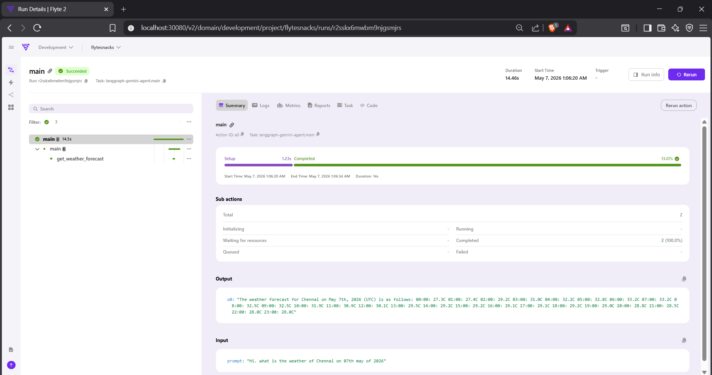
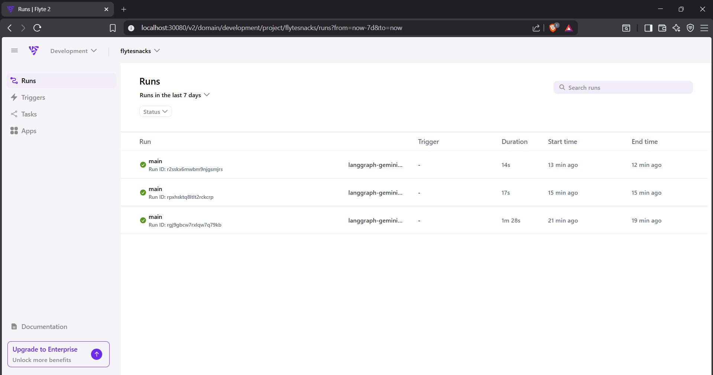
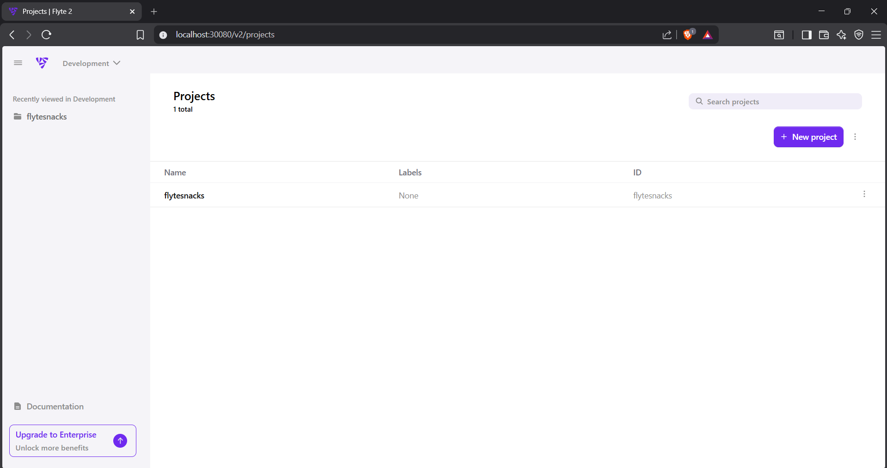
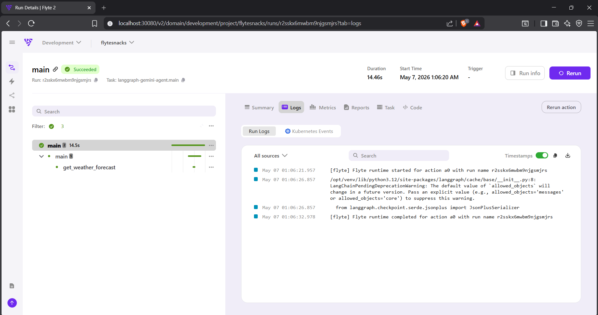
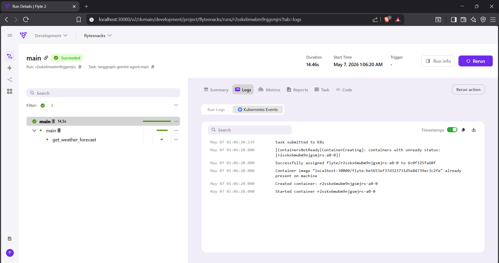

# 🚀 AgentOps with Flyte

Hands-on AgentOps implementation using Flyte for orchestrating AI agent workflows, task automation, monitoring, and distributed execution pipelines.

---

## 🔥 Features

- AI Agent Workflow Orchestration
- Flyte-based Task Scheduling
- Gemini AI Integration
- Distributed Task Execution
- Workflow Monitoring & Observability
- Kubernetes Runtime Events
- Runtime Logging
- Secret Management
- Containerized Execution
- Real-Time Workflow Tracking

---

## 🛠️ Tech Stack

- Flyte
- Python
- LangGraph
- LangChain
- Gemini AI
- Docker
- Kubernetes
- WSL Ubuntu

---

## 📂 Project Structure

```bash
agentops-with-flyte/
├── screenshots/
├── weather_agent.py
├── weather_agent_with_flyte.py
├── requirements.txt
└── README.md
```

---

## 🚀 Running the Project

### Start Flyte Devbox

```bash
flyte start devbox
```

### Create Flyte Config

```bash
flyte create config \
  --endpoint localhost:30080 \
  --project flytesnacks \
  --domain development \
  --builder local \
  --insecure
```

### Run Workflow

```bash
flyte run weather_agent_with_flyte.py main \
  --prompt "Hi. what is the weather of Chennai on 07th may of 2026"
```

---

## 📸 Screenshots

### Workflow Execution Dashboard



### Real-Time Run Monitoring



### Flyte Project Overview



### Runtime Execution Logs



### Kubernetes Runtime Events



---

## 📊 Project Highlights

- Built AI workflow orchestration using Flyte
- Implemented Gemini-powered AI agents
- Added containerized remote execution
- Enabled workflow observability and monitoring
- Integrated Kubernetes runtime tracking
- Managed secrets securely using Flyte secrets

---

## 🎯 Future Improvements

- Multi-agent orchestration
- Prometheus + Grafana monitoring
- Real-time metrics dashboard
- AWS EKS deployment
- Advanced AgentOps observability

---

## 📜 License

MIT License
